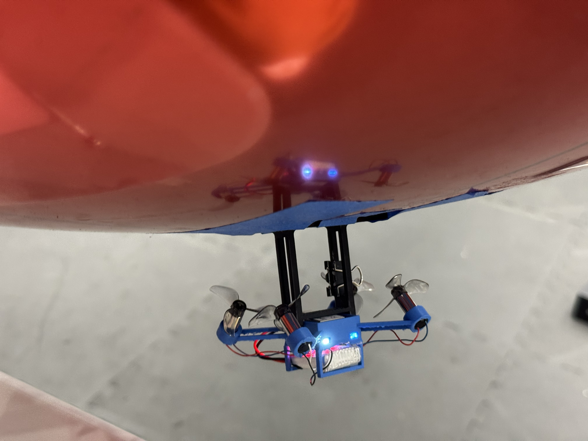

# ESP-FLY Autonomous Blimp

Converting a tiny ESP32-S3 quadcopter into an **autonomous helium blimp** that flies
itself to motion-capture waypoints — hand-flyable and self-flying from a live browser
panel, commanded over a custom **ESP-NOW** radio link so the laptop never has to leave
the lab Wi-Fi.

This repo contains the full stack: the drone firmware, the USB↔radio bridge firmware,
the real-time 3D control/tuning panels, and the printable gondola.

```
OptiTrack ──Wi-Fi──▶ Laptop ──USB──▶ XIAO ESP32-C6 ──ESP-NOW──▶ ESP32-S3 (blimp)
 (pose stream)      (control panel)   (radio bridge)            (guidance + mixing)
```

The laptop stays on the mocap network the whole time — control rides a **separate
ESP-NOW radio path**, solving the "one Wi-Fi radio can't be on two networks at once"
problem.

---

# Getting started

## 1. Getting the code

Clone it or download it — either works. You only need the files on your computer — there is nothing to install
globally and no build step for the ground station.

```bash
git clone https://github.com/BenGreenberg07/esp-fly-blimp.git
cd esp-fly-blimp
```

No git? Click the green **Code ▾ → Download ZIP** button on GitHub and unzip it. Same
thing.

## 2. Minimum files required

**To FLY (ground station only) — this is most people, most of the time:**

| You need | Why |
|---|---|
| `run.py` | the launcher you press ▶ on |
| `config.json` | your Motive IP + rigid-body ID — **you must edit this** |
| `requirements.txt` | the three Python packages |
| `control/` | the panel server + the browser pages + the saved tuning |
| `optitrack_natnet/` | the mocap client (includes a macOS multicast fix) |

That's it. You can ignore `esp-drone/`, `espnow_bridge/`, `hardware/`, `docs/`, and
`archive/` entirely unless you are building or reflashing a blimp.

**To BUILD or REFLASH a blimp**, you also need `esp-drone/` (drone firmware),
`espnow_bridge/` (bridge firmware), and `hardware/` (the printable gondola). See
**[Building a blimp from scratch](#building-a-blimp-from-scratch)** below.

## 3. Install and configure

```bash
pip install -r requirements.txt
```

Then edit **`config.json`**:

```json
{ "motive_ip": "192.168.0.4", "body_id": 531, "up": "Z" }
```

| field | meaning |
|---|---|
| `motive_ip` | IP of the OptiTrack/Motive PC streaming NatNet |
| `body_id`   | the blimp's Rigid Body **Streaming ID** in Motive |
| `up`        | up axis, `"Z"` or `"Y"` (also togglable live in the panel) |

## 4. Run it

Open the folder in VS Code → **Run and Debug** (▶ in the left bar) → pick a panel and
press the green ▶. Or from a terminal:

```bash
python run.py --mode auto
```

The panel opens in your browser. Press **ARM** to connect the USB bridge, then fly.

> **Have running before you press ARM:** the blimp powered on, the ESP32-C6 bridge
> plugged into your computer, and your computer on the same network as the Motive PC.

**Nothing here needs a reflash.** Every gain is a live slider; the drone runs its own
guidance and the panel just streams pose, commands, and tuning to it.

## 5. What each script does

There are two scripts in this repo. The first is the one used for flying:

| Script | When you use it |
|---|---|
| **`run.py`** | **Every time you fly.** Starts the ground station: a small local web server plus the browser page you actually click on. |
| **`flash.py`** | **Rarely.** Only to put new firmware on a board. Not needed to fly, and not needed to change any gain. |

The word "panel" just means that browser page — the thing with the live 3D view, the
buttons, and the sliders. `--mode` picks which page you get (`auto`, `manual`, `wander`,
`swing`); they're all served by the same program.

**The controller is separate from the panel, and it isn't running on your laptop.** The
control math — steering toward the target, holding altitude — lives in the drone's own
firmware (`blimp_guidance.c`). Your laptop only tells it *where it is* and *where to go*,
and passes along gain changes when you move a slider. That's why nothing needs reflashing
when you tune, and why the path drawn on screen is a picture of what the drone is doing
rather than the thing steering it.

(The one exception is the experimental `swing` mode, where the controller does run on the
laptop — explained in [Next steps](#next-steps--the-s-blimp-4-motor-airframe).)

---

# Returning to a point after a hand push

Push the blimp by hand and it curves back to the point it was assigned. This needs no
special mode — it is a direct consequence of the constant-cruise pursuit controller.

1. `python run.py --mode auto`, then **ARM**.
2. Click **⋯ Path** (the path mode button in the *Auto path shape* card).
3. **Click once** in the 2D view, on the spot you want it to live. That single click is
   the whole configuration — one waypoint.
4. Leave **Loop** on. Press **▶ GO**.

It climbs to the target altitude, flies to your point, and then keeps circling it at its
minimum turn radius. Shove it across the room and the steering carrot is still that one
point, so it banks around and comes back on a curve. Let go and it re-converges.

Why a single point is sufficient: in path mode the controller always steers at a "carrot" running
`lookahead` metres along the path ahead of it. With a single waypoint the carrot *is*
that waypoint, permanently — so there is no state to reset and no way for a push to
confuse it. That's it.

**It orbits rather than parks.** The forward motors run at constant cruise and can't
reverse, so the craft cannot brake to a stop — expect a slow circle around the point,
not a hover on it. If you want it to genuinely stop, sit still, and wait to be pushed,
use the **wander** panel instead (`python run.py --mode wander`): it cuts cruise on
arrival so the blimp coasts to a halt and is safe to grab, flashes the LED, waits for
your push, then flies to the next point.

---

# The four panels

All of them are the same server (`control/panel_server.py`) started in a different mode.
See **[control/README.md](control/README.md)** for the full detail.

### ⭐ Auto — `python run.py --mode auto` (port 8601)
The day-to-day tool. Streams your live mocap pose to the drone's **on-board guidance**
(firmware `blimp_guidance.c`) — pure-pursuit steering with a lookahead carrot plus an
altitude PID. Fly a drawn **path**, a **circle**, or a manual X/Y **point**.
Every gain is a live slider. Also has hand-fly, gamepad control, sys-ID test buttons, and
per-run CSV/PNG logging.

### Manual — `python run.py --mode manual` (port 8611)
Pure hand-fly, no autonomy: `W/S` forward, `A/D` turn, `Q/E` up/down, `Space` = kill,
plus hover-assist, trim, and per-direction power sliders. The simplest option for a first
flight, a bridge check, or a motor sanity check.

**Gamepad supported** (Auto mode has it too). An Xbox controller — or any USB/Bluetooth
pad the browser recognises — gives you *proportional* control instead of on/off keys:
**RT** = forward throttle, **right stick X** = turn, **left stick Y** = up/down,
**B** = KILL. The keyboard keeps working alongside it, and if the pad is unplugged or the
tab loses focus the panel falls back to the keys within a fraction of a second, so a
forgotten pad can never hold the motors on. Browsers only expose a gamepad after you
press a button on it, so "no pad" until first input is expected.

### Wander — `python run.py --mode wander` (port 8613)
Flies to a point (random within a box, or a list you click), **parks and coasts to a
stop**, flashes the drone LED to say "safe to touch", waits for a hand push, then picks
the next point. The push is detected from mocap speed, so no extra sensor.

### Swing — `python run.py --mode swing` (port 8620) — **untested**
The new 4-motor S-blimp airframe with an SE(3) Mellinger controller. Built and
bench-verified but **never flown**. See [Next steps](#next-steps--the-s-blimp-4-motor-airframe).

---

# Building a blimp from scratch

Start to finish, in the order you should actually do it.

### Step 1 — Parts

| Part | Notes |
|---|---|
| Seeed **XIAO ESP32-S3** micro-drone (ESP-Drone) | the flight board — 4 brushed motor channels |
| A second **XIAO ESP32-S3** (or ESP32-C6) | the USB↔ESP-NOW bridge that plugs into your laptop |
| 4× brushed coreless motors + props | 2 forward, 1 up, 1 down (see the mixer below) |
| Helium envelope (mylar) | must lift the gondola + battery with a little margin |
| 1S LiPo | small — weight is everything |
| Printed gondola | `hardware/` — see step 2 |
| OptiTrack / Motive + markers | for anything autonomous |

### Step 2 — Print the gondola

In **`hardware/`**:

| File | What it is |
|---|---|
| `gondola-frame-v5.stl` | the flying gondola — print this one |
| `balloon-mount-v2.stl` | the pad that tapes to the envelope |
| `s-blimp-frame-test2.stl` | the 4-motor S-blimp frame (next-gen, see below) |
| `blimp-gondola-mount.f3d`, `esp-blimp-frame.f3d` | Fusion 360 sources, if you want to change dimensions |

Print in PLA, no supports, low infill — every gram costs you helium.

**Two geometry choices that matter more than any gain:**
- **Spread the two forward motors as wide as you can.** Yaw torque scales with their
  separation, and turn authority is the single biggest limit on this vehicle.
- **Mount the gondola centred under the envelope.** An off-centre mount gives a constant
  sideways drift that no controller can remove — this was measured and confirmed, and it
  is the dominant tracking error at low speed.

### Step 3 — Wire the motors

Motor roles are set in firmware, not by which wire you solder where, so you can fix a
mistake in software. The default map (`power_distribution_stock.c`):

```
M1 = DOWN      M2 = forward-LEFT      M3 = forward-RIGHT      M4 = UP
```

Verify it before you fly: `python control/check_link.py --spin` spins each channel
briefly at low power (**props off**) so you can see which motor is which. If they don't
match, edit the `MOTOR_FWD_LEFT / MOTOR_FWD_RIGHT / MOTOR_UP / MOTOR_DOWN` defines and
reflash — don't resolder.

### Step 4 — Flash the drone (ESP32-S3)

Install **ESP-IDF v5.0.x**, then:

```bash
cd esp-drone
idf.py set-target esp32s3      # FIRST TIME ONLY — the committed sdkconfig needs this
idf.py build
idf.py -p /dev/cu.usbmodemXXXX flash
```

Or let the helper script do all of that for you, on any OS:

```bash
python flash.py drone
```

It finds the port, sets up ESP-IDF if it isn't already on your PATH, and builds and
flashes in one step.

> **If flashing fails** with *"No serial data received"* or *"Invalid head of packet"*:
> the S3 talks over its internal USB-Serial-JTAG. Add `--before usb_reset`, or unplug the
> LiPo and replug the USB cable, then retry immediately. The chip is never damaged by a
> failed connect — esptool fails before it writes anything.

### Step 5 — Flash the bridge (ESP32-S3 or C6)

The bridge can be **either a XIAO ESP32-S3 or a XIAO ESP32-C6** — the same sketch builds
for both (the C6-only antenna switch is compiled out on an S3). An S3 is the easy choice
since it's the same board as the drone:

```bash
python flash.py bridge            # XIAO ESP32-S3 (default)
python flash.py bridge --board c6 # XIAO ESP32-C6
```

Needs `arduino-cli` with the Arduino **esp32 core 3.x**. The Arduino IDE works too — open
`espnow_bridge/espnow_bridge.ino` and pick board `XIAO_ESP32S3` or `XIAO_ESP32C6`.

> If you use `arduino-cli` by hand, note that `upload` on its own re-flashes the *last
> compiled* binary — always `compile --upload` together or you'll flash a stale sketch.
> (`flash.py` does this correctly for you.)

> **Using a C6?** Check whether your board has a u.FL external-antenna connector. The
> sketch enables the external antenna, so the physical antenna must be attached — with
> the switch set and no antenna fitted, range is *worse* than stock.

Your USB adapter will usually only show **one** port at a time, so flash the two boards
one after the other, not together.

### Step 6 — Bind the drone to its bridge

There is **no MAC address to type in**. Pairing is a 4-byte tag called `FRAME_MAGIC` that
both ends stamp on every packet and reject if it's missing — that's what stops your blimp
from being flown by the other ESP-NOW traffic in the room (which was a real bug: foreign
frames were being parsed as gain updates and crashing the drone).

A bridge and a drone are **bound when their `FRAME_MAGIC` values match**:

| File | Where |
|---|---|
| `espnow_bridge/espnow_bridge.ino` | search for `FRAME_MAGIC` (~line 42) |
| `esp-drone/components/espnow_control/espnow_control.c` | search for `FRAME_MAGIC` (~line 46) |

Out of the box both are `{0xB1, 0x12, 0x9F, 0x5A}` and one drone works with no changes.

**Flying a second blimp in the same room:** give triplet #2 (its own laptop + bridge +
drone) a different `FRAME_MAGIC` — any 4 bytes — set **identically in both files**, then
reflash **both** of its boards. Leave triplet #1 and `TELEM_MAGIC` alone, and keep
everyone on channel 1. Full write-up: [espnow_bridge/README.md](espnow_bridge/README.md).

### Step 7 — First flight

1. Fill the envelope so it is **very slightly negatively buoyant** — it should sink
   slowly when you let go. Trim with tape.
2. Plug the C6 into the laptop, power the blimp.
3. `python control/check_link.py` — confirms the drone is actually replying over
   ESP-NOW (motor telemetry, not just an open serial port). Do this before blaming the
   panel.
4. `python run.py --mode manual` → **ARM** → hand-fly it. Get up/down and turning
   working, and set the power sliders where it feels controllable.
5. Only then go autonomous: `python run.py --mode auto`, create your rigid body in
   Motive, check the tracking pill goes green, and try the
   [come-back-when-pushed](#make-it-come-back-when-you-push-it) recipe above.

**If it turns the wrong way**, hit **⟳ Flip turn direction** in the panel (it flips the
sign of `turnMaxPwm`). Don't rewire.

---

# Tuning

Every gain — manual powers/trims and autonomous pursuit/hover gains — is a live slider.
Values ride the ESP-NOW link and update the controller in RAM instantly, with no reflash.
The panels are **self-contained** (pure-canvas 2D/3D, no CDNs) so they run on a
locked-down lab network, and they save automatically.

`control/mocap_config.json` ships with **the tuning currently flying on my blimp**, so a
fresh clone starts from known-good numbers instead of defaults:

| | |
|---|---|
| `fwdMaxN` 0.18 | constant forward cruise — the main speed/turn-radius trade |
| `kpHead` 2.65, `kdHead` 0.037 | pursuit steering PD (kd is the anti-overshoot term) |
| `turnCap` 0.9, `turnBoost` 0.35 | turn authority and how symmetric the differential is |
| `driftK` 1.3 | crab into the sideways drift |
| `zff` 19000, `vertMaxPwm` 28000 | buoyancy feedforward and its output ceiling |

**Radius scales with speed.** Flying wider circles than you drew is almost always
`fwdMaxN` being too high, not a steering gain. Slowing down is the strongest lever.

# Repo layout

```
run.py                  ▶ the launcher (VS Code ▶, or `python run.py --mode auto`)
config.json             your Motive IP + rigid-body IDs — EDIT THIS
requirements.txt        Python deps (numpy, matplotlib, pyserial)

control/                the ground station — everything you need to fly
  ├─ panel_server.py          the server behind all four modes
  ├─ auto_panel.html          Auto page (2D/3D mocap view, path drawing, live tuning)
  ├─ manual_panel.html        Manual hand-fly page
  ├─ wander_panel.html        Wander page (park → wait for a push → next point)
  ├─ swing_panel.html         Swing / S-blimp page (untested)
  ├─ swing_panel_server.py    Swing server — separate controller and motor layout
  ├─ mellinger_core.py        SE(3) Mellinger controller + the geometry-driven mixer
  ├─ swing_trajectory.py      trajectory generator for the swing build
  ├─ mocap_config.json        the tuning that is currently flying
  ├─ check_link.py            terminal-only link + motor test (run this first)
  └─ flight_logs/plant_final_*.json    identified dynamics model

hardware/               printable gondola (STL) + Fusion 360 sources + the S-blimp photo
esp-drone/              on-board drone firmware (ESP-IDF, ESP-Drone derivative)
espnow_bridge/          XIAO ESP32-C6 USB↔ESP-NOW bridge (Arduino) + pairing guide
optitrack_natnet/       OptiTrack NatNet client (incl. a macOS multicast fix)
docs/                   design notes and write-ups
archive/                earlier / superseded tools kept for history
```

Inherited the physical hardware rather than building your own? The specific IDs,
addresses, and quirks of the blimp I actually flew are in
[docs/THIS_EXACT_BLIMP.md](docs/THIS_EXACT_BLIMP.md).

### On-board firmware (custom components)
Built on Espressif's [ESP-Drone](https://github.com/espressif/esp-drone) (a Crazyflie
port). The custom work:
- `.../blimp_guidance.c` — the on-board guidance controller (pursuit + carrot + altitude
  PID + soft-start + spin abort)
- `.../power_distribution_stock.c` — blimp motor mixer (constant-forward + differential
  turn, vertical sign/dead-band) and the swing-build 4-motor branch
- `.../stabilizer.c`, `.../system.c` — blimp flight mode + radio-link selection
- `components/espnow_control/` — ESP-NOW receiver (manual + pose + gains frames, magic-tag
  filtering, link-loss failsafe) and the motor-telemetry return path
- `components/ble_control/` — BLE control link (parked)

---

# Next steps — the S-blimp 4-motor airframe



The next airframe replaces "2 forward + 1 up + 1 down" with **four motors on an X-frame,
all pointing roughly upward, canted about 45°** (photo above; frame is
`hardware/s-blimp-frame-test2.stl`).

**Motivation.** The current blimp's problems all trace back to one thing: the only
horizontal actuator is a pair of unidirectional forward motors, so it can't brake, can't
rotate in place, and drifts sideways through every turn. Four canted motors change the
actuation entirely — vertical thrust and yaw come out directly, and horizontal motion
comes from **tilting the envelope so the gondola's pendulum swings and the tilted lift
vector pulls it along** (hence "swing blimp").

**What already exists in this repo (built, bench-tested, `--mode swing`):**
- `control/mellinger_core.py` — a port of the Bitcraze **SE(3) Mellinger** controller,
  running host-side because it needs the full attitude quaternion every tick and the
  pose frame only carries position + yaw.
- A **geometry-driven mixer**: per-motor position + thrust axis → a 4×4 allocation
  matrix, solved by damped least-squares because the matrix is **singular by design**.
  Three switchable cant layouts (`lateral`, `foreaft`, `tangential`); unachievable force
  is routed into a moment, which is what makes the swing happen.
- Firmware support behind `#define BLIMP_SWING` (default 0 — nothing changes until you
  set it). In this build the drone is a **dumb 4-channel motor amplifier** and the wire
  format is the unchanged `0xA5` frame, so **only the drone reflashes, not the bridge**.
- A panel with props-off per-motor bench buttons and a motor-map editor, so you map
  channels to arms by clicking rather than resoldering.

**Remaining work:**
1. `python flash.py swing` (drone only; `python flash.py drone` puts the old blimp back).
2. Props off — bench-test M1..M4 and set the motor map from what actually spins.
3. Confirm the real cant matches a layout — watch which allocation row reads zero.
4. Raise `hover` until it floats, then ENGAGE with the target at its current position.
5. **Start the rate-D gains (`kw_*`, `kd_omega_rp`) well below the reference values** —
   they assume a 500 Hz IMU, but here body rates come from 25 Hz mocap.

---

# Future additions

### PCB with an integrated ESP32
Today the flight board is a XIAO module soldered onto a carrier — the between-board
joints are the most fragile thing on the vehicle and they add height and weight. The plan
is a **custom PCB with the ESP32-S3 native on the board**: no module, no inter-chip
soldering, one part to place.

### H-bridge motor drivers for reverse thrust
The single biggest limitation of the whole design is that the brushed motors are driven
by one low-side MOSFET each, so they only spin one way. Adding **H-bridge drivers
(e.g. DRV8833)** would let the forward motors reverse, which buys:
- **turning in place** — oppose the two forward motors instead of arcing
- **braking**, so it can actually stop on a point instead of orbiting it
- much tighter path tracking, since the min-turn-radius floor largely goes away

This needs signed PWM in the mixer and a firmware reflash once the hardware is wired.

**PCB design files and work-in-progress:**
[Google Drive folder](https://drive.google.com/drive/folders/18QSSe5u8A_p2iix2rqLfaRU-QODWJp0w)

---

# Wi-Fi mode (fallback, and how to revert)

ESP-NOW is the primary control link, but the drone **also brings up its own Wi-Fi access
point**, so Wi-Fi control is available at any time with no reflashing.

| Setting | Value |
|---|---|
| SSID | `ESP-DRONE_xxxxxxxxxxxx` |
| Password | `12345678` |
| Control link (CRTP over UDP) | `udp://192.168.43.42:2390` |

There's no bundled panel for this path — drive it with `cflib`'s `cfclient` or your own
script. Older keyboard-teleop clients (`drive_blimp*.py`) are in `archive/`.

**To make Wi-Fi the *only* radio**, edit
`esp-drone/components/core/crazyflie/modules/src/system.c`:

```c
#define ESPNOW_CONTROL_ENABLED 0   // 1 = ESP-NOW (default), 0 = Wi-Fi only
#define BLE_CONTROL_ENABLED    0   // (BLE link, normally off)
```

then rebuild and flash.

---

# Troubleshooting

**If the panel will not connect, or nothing moves,** run the terminal-only check first — it opens
the bridge, confirms the drone is really replying over ESP-NOW, and can spin each motor:

```bash
python control/check_link.py                       # test the link only (no spin)
python control/check_link.py --spin                # + spin each channel briefly, props OFF
python control/check_link.py --bridge-port COM5    # if auto-detect picks the wrong port
```

| Symptom | Cause |
|---|---|
| Tracking pill never goes green | laptop isn't on the mocap network, or the wrong `body_id` |
| Flies wider circles than drawn | `fwdMaxN` too high — slow it down |
| Turns the wrong way | **⟳ Flip turn direction** in the panel |
| Sinks during flight | buoyancy or battery sag, not gains — check `zff` isn't above `vertMaxPwm` |
| Random jitter / drone reboots ~3 s in | another ESP-NOW device in the room; check `FRAME_MAGIC` matches on both your boards |

---

# License
The `esp-drone/` firmware is a derivative of Espressif ESP-Drone and remains **GPL-3.0**
(original license headers retained). The host-side tools, panels, and hardware are
original work by the author.

---

*Built by Ben Greenberg. An exercise in re-purposing a flight controller, control design
around a hard actuation constraint, embedded radio links, and real-time tooling.*
